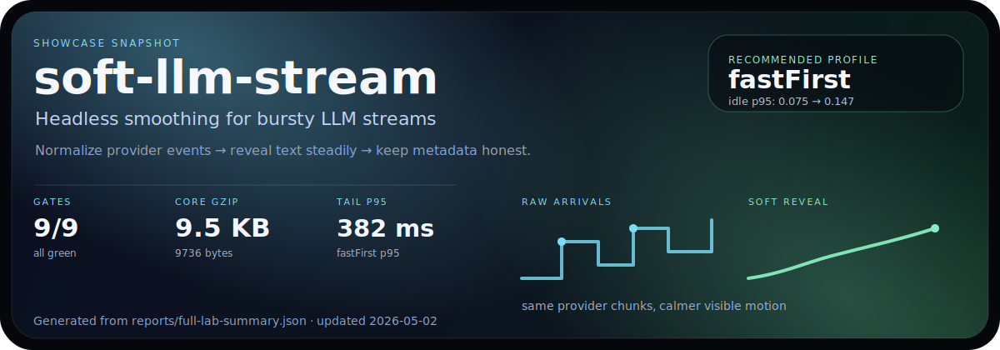
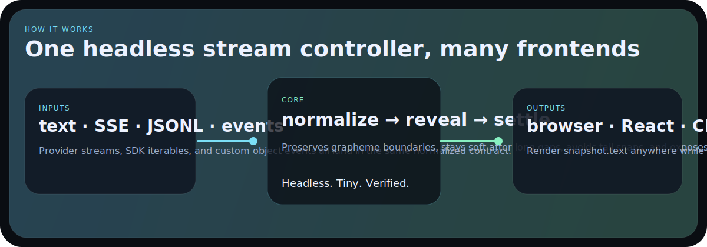

# soft-llm-stream

Small headless smoothing for bursty LLM text streams.

`soft-llm-stream` sits between an incoming stream and the UI. It normalizes real provider output, keeps reveal speed perceptually steadier, preserves grapheme boundaries, stays soft after long gaps, and finishes without ugly tail snaps.





## Why this exists

Most chat UIs still have the same three failure modes:

- **dump** — a buffered chunk lands and half the answer appears at once
- **crawl** — the text already exists but the UI reveals it too slowly to feel responsive
- **lie** — the UI keeps pretending to type while no new data has arrived yet

`soft-llm-stream` is built to smooth the first two and make the third avoidable by keeping `meta` phases separate from visible answer text.

## What the package is

- headless runtime with no framework lock-in
- works with raw text, SSE, JSONL / NDJSON, and normalized event streams
- preserves grapheme-safe reveal boundaries
- designed for browser apps, CLI tools, and SDK wrappers
- validated with protocol tests, synthetic labs, stress traces, size budgets, and release gates

## Publish shape

The **source repo** keeps the full validation surface, browser demo, examples, and docs.
The **published artifact** is intentionally core-only:

- package: `@ramenm/soft-llm-stream`
- public entry point: `.`
- staged publish directory: `./package`
- staged content: `dist/core.js`, tiny `package.json`, tiny `README.md`

Current confirmed size targets in this revision:

- staged core runtime gzip: **9736 B**
- staged npm tarball: **10054 B**

## Install

```bash
npm install @ramenm/soft-llm-stream
```

## Basic usage with HTTP

```ts
import { createSoftLlmChatStream } from '@ramenm/soft-llm-stream';

const store = createSoftLlmChatStream({
  source: fetch('/api/chat'),
  adapter: 'auto',
  revealProfile: 'fastFirst',
});

const unsubscribe = store.subscribe(() => {
  const snapshot = store.getSnapshot();
  render(snapshot.text, snapshot.meta.phase);
});

await store.start();
unsubscribe();
```

## Object-stream usage

```ts
import { createSoftLlmStream } from '@ramenm/soft-llm-stream';

async function* source() {
  yield { type: 'meta', data: { phase: 'thinking' } };
  yield { type: 'text', text: 'Hello' };
  yield { type: 'replace', text: 'Hello from an SDK event stream.' };
  yield { type: 'done' };
}

const store = createSoftLlmStream({
  source: source(),
  adapter: 'event',
  revealProfile: 'balanced',
});

await store.start();
console.log(store.getSnapshot().text);
```

More executable examples live in [`./examples`](./examples/README.md).

## Public runtime API

- `createSoftLlmStream`
- `createSoftLlmChatStream`
- `adapters`
- reveal tuning exports
  - `DEFAULT_REVEAL_TUNING`
  - `FAST_FIRST_REVEAL_TUNING`
  - `SOFT_FINISH_REVEAL_TUNING`
  - `REVEAL_TUNING_PRESETS`
  - `mergeRevealTuning`
  - `resolveRevealTuningPreset`

## Stream contract for custom backends

Use one normalized event shape everywhere:

- `text` for true append deltas
- `replace` for cumulative snapshots or corrections
- `meta` for progress, tool, or search phases that should not become visible answer text
- `done` when the stream is finished

JSONL example:

```jsonl
{"type":"meta","data":{"phase":"thinking"}}
{"type":"text","text":"Let me check that."}
{"type":"meta","data":{"phase":"tool"}}
{"type":"replace","text":"Let me check that against the latest records."}
{"type":"done"}
```

More detail: [`docs/transport-contract.md`](./docs/transport-contract.md)

## Reveal profiles

- `balanced` — safest default for general use
- `fastFirst` — best default for demos and product-first chat UIs
- `softFinish` — gentler tail behavior when end-of-answer smoothness matters most

## Browser demo

Run the side-by-side browser compare:

```bash
npm run demo:web:ready
```

If you want to rebuild from source instead of using the checked-in `dist/`, run `npm install` first and then use `npm run demo:web`.

The demo now includes a live summary strip for:

- largest visible jump
- longest visible freeze
- visible update count
- smooth-vs-raw completion delta

That makes the page much easier to show in a meeting or record for a showcase clip.

## Quick check from this archive

This archive already includes `dist/` and the lean-package fallback artifact, so the fastest validation path works without installing dependencies:

```bash
npm run check:quick
```

## Local validation

For a full source rebuild and typecheck flow:

```bash
npm install
npm run typecheck
npm test
npm run lab:protocol
npm run lab:full
npm run examples:smoke
npm run size:check
npm run showcase:check
```

Artifacts produced by the full lab:

- `reports/full-lab-summary.json`
- `reports/full-lab-summary.md`
- `docs/assets/quality-card.svg`

`npm run size:check` now validates the staged package three ways: it smoke-imports the staged core, installs the packed tarball into a clean temporary consumer for a tiny runtime flow, and runs a strict TypeScript compile against the packaged declarations.

## Repo map

- [`examples/`](./examples/README.md) — executable usage samples
- [`docs/showcase.md`](./docs/showcase.md) — short live-demo flow and talking points
- [`docs/README.md`](./docs/README.md) — setup and validation notes
- [`docs/evals.md`](./docs/evals.md) — benchmark philosophy and thresholds
- [`docs/size-budgets.md`](./docs/size-budgets.md) — publish-size constraints
- [`reports/full-lab-summary.md`](./reports/full-lab-summary.md) — current benchmark snapshot

## Development notes

- root workspace stays private on purpose
- staged publish package stays core-only on purpose
- staged publish package now includes bundled TypeScript declarations for npm consumers
- lean-package builds are reproducible even without a local minifier, as long as the checked-in fallback artifact still matches the bundled source hash

## License

MIT
